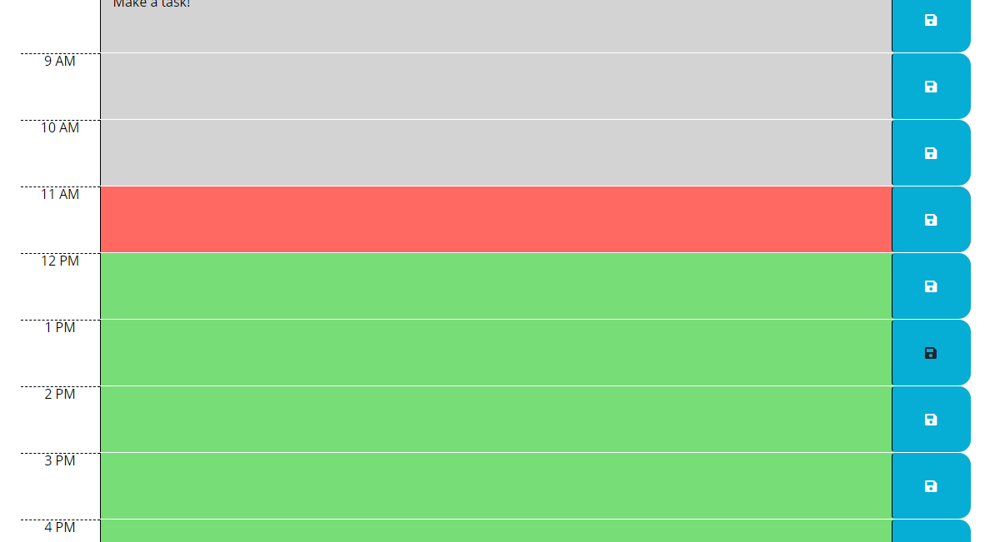

# Work Day Scheduler Application

## Purpose
This is a work day calendar application to help the user keep track of events and plans throughout the day. 

## User Story 
```
AS AN employee with a busy schedule
I WANT to add important events to a daily planner
SO THAT I can manage my time effectively
```
## Built With
* HTML
* CSS
* Javascript 
* JQuery
* Moment.js
* Bootstrap

## Website

GitPages Deployed URL : https://clhurlbut.github.io/calendar-app/

Github Repository URL : https://github.com/clhurlbut/calendar-app/

## Screenshot




## References 

* https://www.w3schools.com/js/
* https://developer.mozilla.org/en-US/docs/Web/API/
* https://momentjs.com/
* https://jqueryui.com/
* https://developer.mozilla.org/en-US/docs/Learn/HTML/Howto/Use_data_attributes


## Contribution
Made with :potato: by Cassie Hurlbut for UCLA Coding Bootcamp / Trilogy 

##### Thank you UCLA Coding Bootcamp / Trilogy! 
